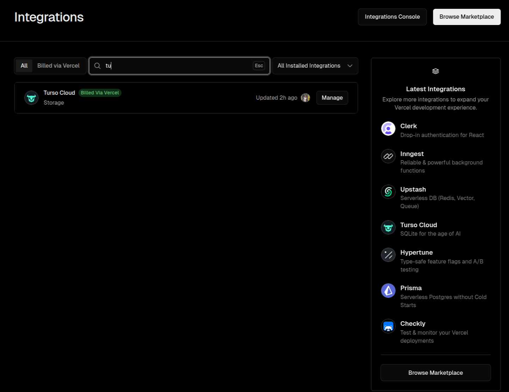
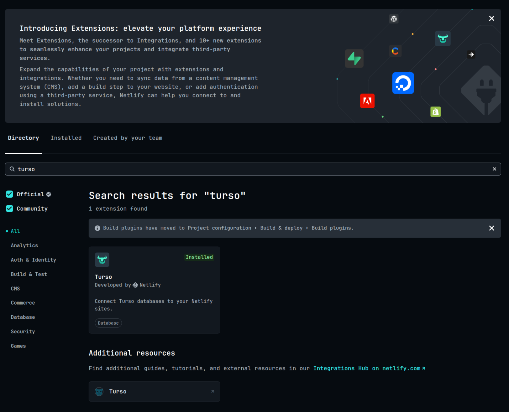
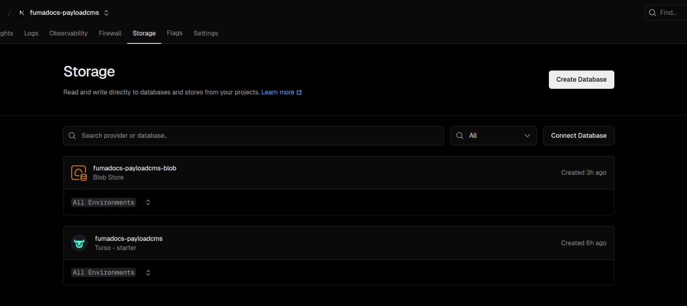
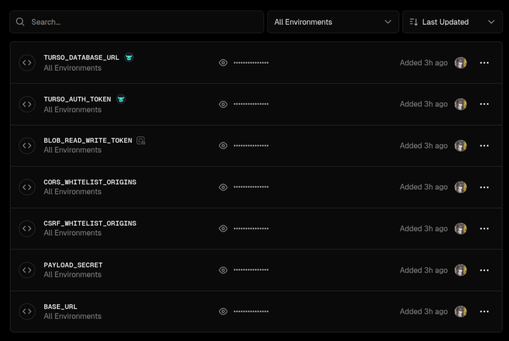

<div align="center">
<h1><strong> <a href="https://fumdocs.dev">
  
</a> Fumadocs + PayloadCMS <a href="https://payloadcms.com">
  
</a> </strong> </h1>
</div>

| [Fumadocs](https://fumadocs.dev) | [Payload CMS](https://payloadcms.com) | 
|-|-|
|  |  |

<div align="center">


<a href="https://conventionalcommits.org"></a> 
</div>

Simple, deploy-ready example for using [Fumadocs](https://fumadocs.dev) with [Payload CMS](https://payloadcms.com) combined into a single [Next.js](https://nextjs.org) app.

[](https://codesandbox.io/p/github/MFarabi619/fumadocs-payloadcms/main?import=true&embed=1&showConsole=true)

## Local Setup

Initialize the project:

```bash
pnpm i
```

Run development server:

```bash
pnpm dev
```

Open http://localhost:3000 with your browser to see the result.

## Deploy

Before deploying, set the variables from `.env.example` in your `.env.production` or hosting platform.

Make sure to add your production `BASE_URL` to CORS & CSRF origins as well to be able to query the deployed API endpoints.

This example uses [SQLite](https://www.sqlite.org) as the database. You can deploy it to any Next.js-compatible platform with a cloud integration with providers such as [Turso](https://turso.tech).

For object storage, this example uses [Vercel Blob](https://vercel.com/docs/vercel-blob). You can use any [storage adapter](https://payloadcms.com/docs/upload/storage-adapters) of your choice.

| [Vercel](https://vercel.com) | [Netlify](https://netlify.com) |
|-|-|
|  |  |

Both Turso & Vercel Blob were set up via storage integrations for this deployed example. 

| | |
|-|-|
|  |  |


## Alternatives
- [fumadocs-payload-template - bapspatil](https://github.com/bapspatil/fumadocs-payload-template)

## Learn More

To learn more about Next.js and Fumadocs, take a look at the following
resources:

- [Next.js Documentation](https://nextjs.org/docs) - learn about Next.js
  features and API.
- [Learn Next.js](https://nextjs.org/learn) - an interactive Next.js tutorial.
