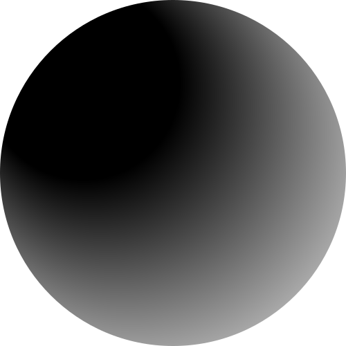
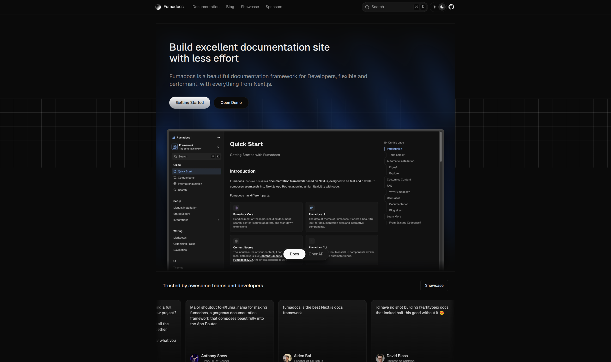
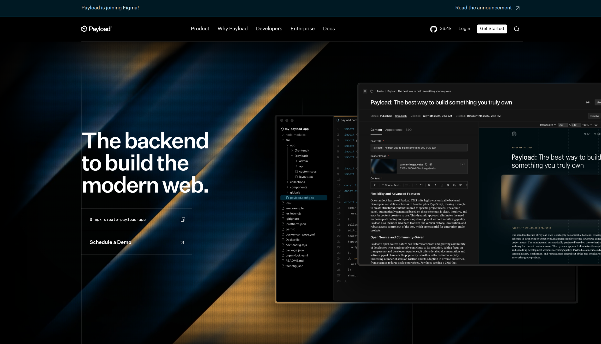

<div align="center">
<h1><strong> <a href="https://fumdocs.dev">
  
</a> Fumadocs + PayloadCMS <a href="https://payloadcms.com">
  
</a> </strong> </h1>
</div>

| [Fumadocs](https://fumadocs.dev) | [Payload CMS](https://payloadcms.com) | 
|-|-|
|  |  |

This is a simple example for using [Fumadocs](https://fumadocs.dev) with [Payload CMS](https://payloadcms.com) combined into a single [Next.js](https://nextjs.org) app.

## Setup

Initialize the project:

```bash
pnpm i
```

Run development server:

```bash
pnpm dev
```

Open http://localhost:3000 with your browser to see the result.

## Deploy

Before deploying, set the variables from `.env.example` in your `.env.production` or hosting platform.

Make sure to add your production url to CORS & CSRF origins as well to be able to query the deployed API endpoints.

You can deploy it to any Next.js-compatible platform.

## Learn More

To learn more about Next.js and Fumadocs, take a look at the following
resources:

- [Next.js Documentation](https://nextjs.org/docs) - learn about Next.js
  features and API.
- [Learn Next.js](https://nextjs.org/learn) - an interactive Next.js tutorial.
- [Fumadocs](https://fumadocs.vercel.app) - learn about Fumadocs
